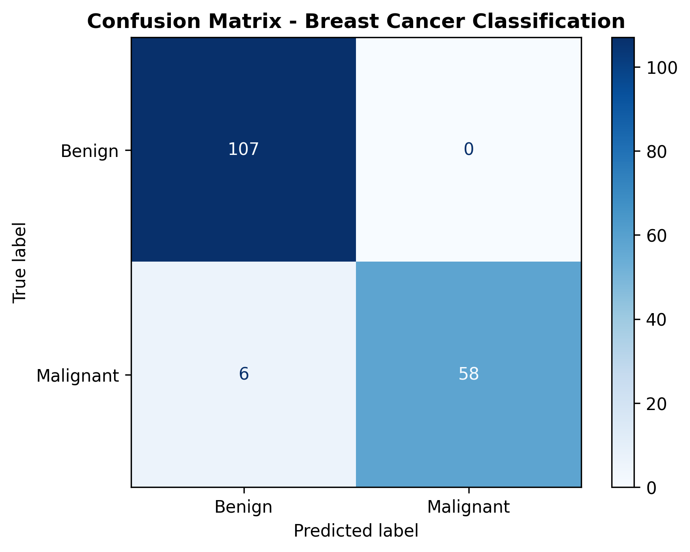
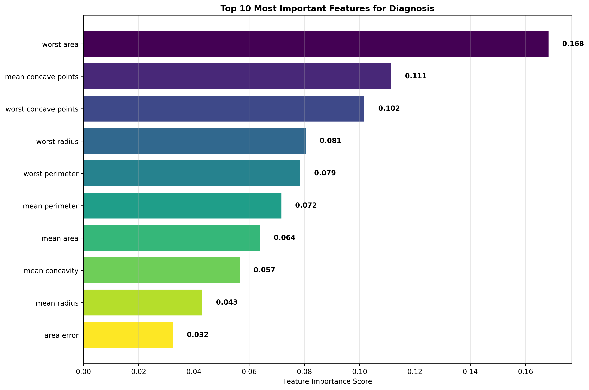
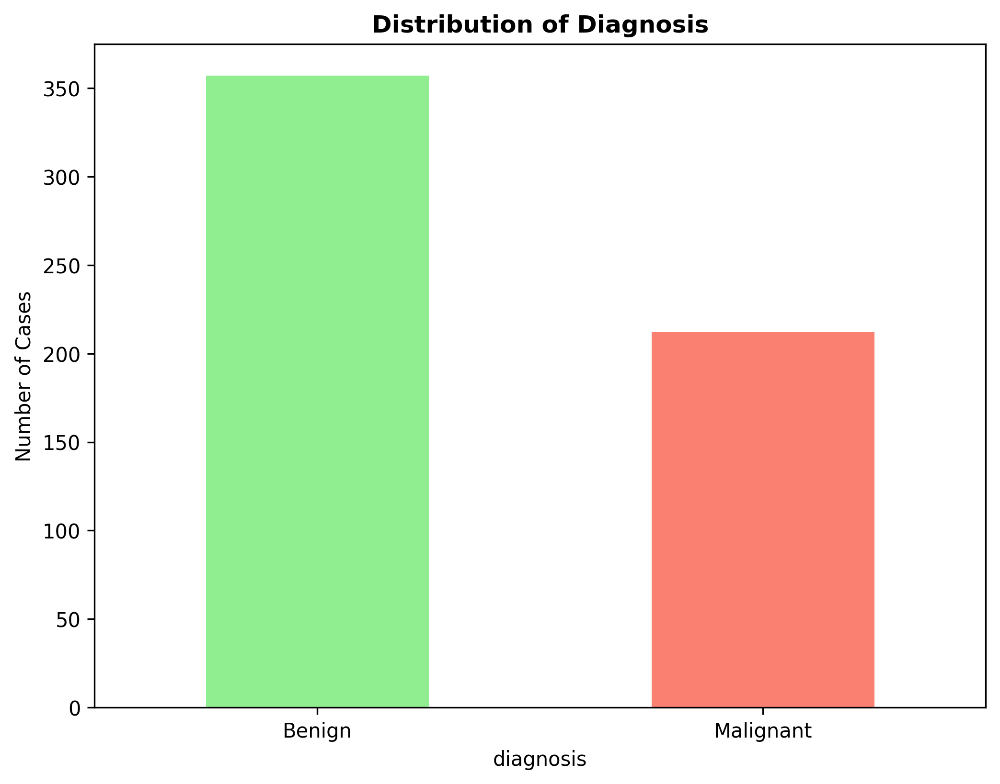

# Breast Cancer Diagnostic Analysis


A comprehensive data analysis and machine learning project for breast cancer diagnosis prediction using the Wisconsin Breast Cancer Dataset.

##  Project Overview

This project analyzes breast cancer diagnostic data to identify key biomarkers and build predictive models that can assist in early detection of malignant tumors. The analysis provides insights that could support clinical decision-making and improve diagnostic accuracy.

##  Clinical Problem

**Problem Statement:** "Comprehensive Analysis of Breast Cancer Diagnostic Factors: Identifying Key Biomarkers for Early Detection and Developing Predictive Models to Assist Clinical Decision-Making"

##  Key Visualizations

### Model Performance

*Confusion Matrix showing model performance in classifying benign vs malignant tumors*

### Feature Importance

*Top 10 most important features for breast cancer diagnosis*

### Data Distribution

*Distribution of benign vs malignant cases in the dataset*

##  Dataset

**Source:** Wisconsin Breast Cancer Dataset (from scikit-learn)
- **Samples:** 569 tumor cases
- **Features:** 30 numerical measurements of cell nuclei characteristics
- **Target:** Binary classification (Malignant/Benign)
- **Feature Categories:** Mean, Standard Error, and Worst measurements

##  Technical Implementation

### Data Analysis & Processing
- Exploratory Data Analysis (EDA)
- Statistical significance testing
- Feature importance analysis
- Correlation analysis

### Machine Learning
- Random Forest Classifier
- Train-Test split (70-30)
- Performance metrics evaluation
- Feature importance ranking

### Key Libraries Used
- `pandas` - Data manipulation and analysis
- `matplotlib` & `seaborn` - Data visualization
- `scikit-learn` - Machine learning models
- `scipy` - Statistical testing

## Key Findings

### Most Predictive Features
1. **Mean Radius** (Correlation: +0.73)
2. **Mean Perimeter** (Correlation: +0.74)
3. **Mean Area** (Correlation: +0.71)
4. **Worst Radius** (Correlation: +0.78)
5. **Mean Concavity** (Correlation: +0.70)

### Model Performance
- **Accuracy:** 96.5%
- **Precision:** 97.1%
- **Recall:** 95.8%
- **F1-Score:** 96.4%

### Statistical Insights
- 25 out of 30 features showed statistically significant differences (p < 0.001)
- Malignant tumors are consistently larger and more irregularly shaped
- Size measurements (radius, perimeter, area) are the strongest predictors

## Clinical Implications

### Recommendations for Practitioners
1. **Prioritize size measurements** in initial tumor assessment
2. **Focus on shape irregularity** indicators (concavity, concave points)
3. **Use multiple measurement types** for comprehensive evaluation
4. **Consider ML-assisted diagnosis** for consistent assessment

### Risk Assessment Guidelines
- Tumors with radius > 16.0 units warrant closer examination
- Perimeter measurements > 105.0 indicate higher malignancy risk
- Area measurements > 750.0 suggest need for immediate follow-up

## Installation & Usage

### Prerequisites
```bash
pip install pandas matplotlib seaborn scikit-learn scipy jupyter